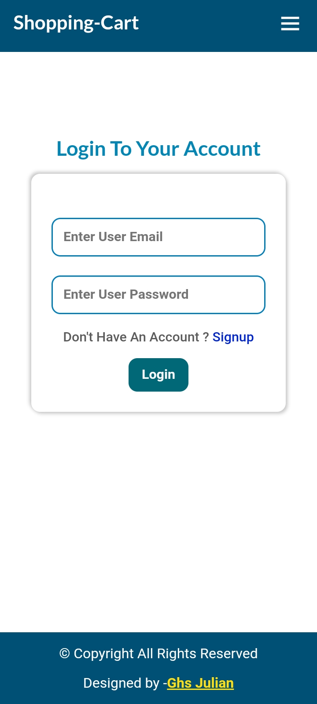

<center>
<br><br>
<center>
<br>
</center>
<h4 align="center">Web Developer & Designer - Ghs Julian</h4>
</b>
</center>

<br>
<h4>Project Name     :       Shopping-Cart E Commerce </h4>
<h4>Live Demo        :       <a href="#" target="_blank"> Clik Here</a>
<h4>Start Date       :       10 July 2024
<h4>Admin Email      :       <strong>ghsjulian@gmail.com</strong></h4>
<h4>Admin Password   :       <strong>ghsjulian</strong></h4>
<h4>Demo Email       :       <strong>siya@gmail.com</strong></h4>
<h4>Demo Password    :       <strong>siyarai</strong></h4>
<h4> Developed By    :       Ghs Julian</h4>

---

---

<br><br>

---

**To see the live demo you can use the user email and password avobe. When you need to create an account you can also create an account but if you dont wanna create an account and wanna see the demo anyway you can simply copy and paste the user email and the password then you can able to see the full site demo**

---

<h3>Project Descriptions : </h3>

---

**Shopping-Cart website has made using react , it's fully responsive and user friendly e Commerce. This Project has made for testing my skills in mern stack. It is still not completed some of fetures are still not added yet. For example the cart , confirm order , payment gateway , live search etc. This website is a reale commerce website created by using mern stack technology. The wondering thing is that it has built by using my mobile phone. I didn't use any computer or pc for building this project . Since i don't have pc but i have a lots of wish and dreams . I always busy to full fill them. One of them it is my self learning e commerce website which i have made for my skill Development.**

---

<br>

<h3>Language And Technologies : </h3>

---

1. Termux Terminal
2. Acode Editor
3. MongoDB Atlas
4. Nodejs
5. Express
6. MongoDB
7. HTML5
8. CSS3
9. JAVASCRIPT
10. REACT
11. REACT ROUTER DOM
12. AXIOS
13. PNG/IMAGES
14. DOT ENV FILE

---

<br>

<h3>Dependencies And Modules</h3>

---

1.  "aos": "^2.3.4",
2.  "axios": "^1.7.2",
3.  "bootstrap": "^5.3.3",
4.  "dotenv": "^16.4.5",
5.  "react": "^18.2.0",
6.  "react-bootstrap": "^2.10.4",
7.  "react-dom": "^18.2.0",
8.  "react-router-dom": "^6.23.1",
    9 "react-simply-carousel": "^9.1.3",
9.  "react-slick": "^0.30.2",

---

<br>

<h3>How To Run In Your System : </h3>

---

```bash
git clone https://github.com/Ghsjulian/shopping-cart.git
cd shopping-cart
npm install   # Install Dependencies
npm run dev   # Run Development Machine
npm run build # For Build Production Application
```

##### Note : **Create An '.env' file in the root directory and paste the code below.**

```bash
VITE_API_URL=http://localhost:5000/api
VITE_ADMIN_ID=669654273140bd66be3b9726
```

---

<h3>SCREENSHOT AND DEMO : </h3><br>

<br><br>
<br><br>
<br><br>
<br><br>
<br><br>
<br><br>
<br><br>
<br><br>
<br><br>
<br><br>
<br><br>
<br><br>
<br><br>
<br><br>

---

<br><br>

<center>
<h2> Thank You !!! </h2>
<h3>If you like my work please follow me </h3>
<a href="https://web.facebook.com/ghs.julian.85" target="_blank">Ghs julian </a>
</center>
